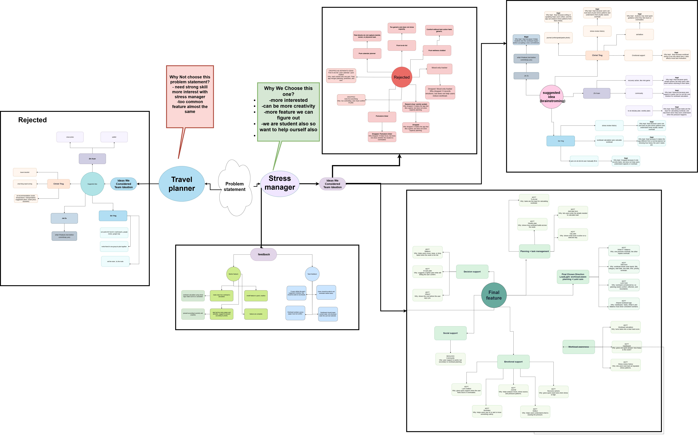
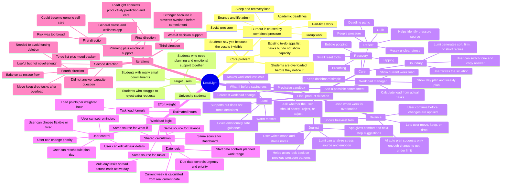
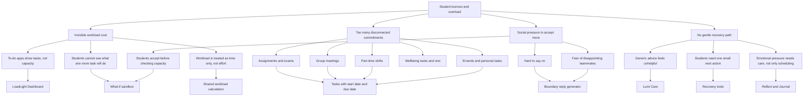
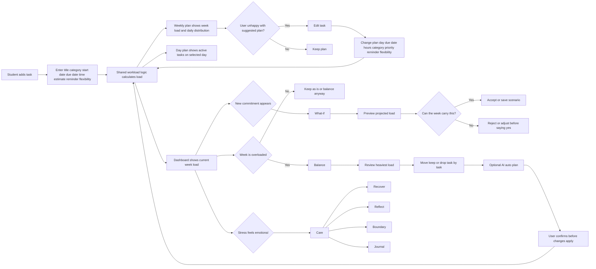

<a id="top"></a>

<div align="center">

# LoadLight

### Lighten your load.


### Hello, welcome to LoadLight.

**A stress and workload manager for students who need to see capacity before saying yes.**

Team roti canAI · CodeNection 2026 · Lifestyle Track: Beating the Burnout

<br />


<br />
<br />

<a href="#submission-links"><strong>Submission Links</strong></a>
&nbsp;·&nbsp;
<a href="#reviewer-fast-path"><strong>Reviewer Fast Path</strong></a>
&nbsp;·&nbsp;
<a href="#core-features"><strong>Core Features</strong></a>
&nbsp;·&nbsp;
<a href="#2-ideation--process"><strong>Ideation</strong></a>
&nbsp;·&nbsp;
<a href="#4-what-makes-it-different"><strong>Novelty</strong></a>
&nbsp;·&nbsp;
<a href="#5-technical-architecture--feasibility"><strong>Tech</strong></a>
&nbsp;·&nbsp;
<a href="#10-rubric-coverage-map"><strong>Rubric Map</strong></a>

</div>

---

## At a Glance

| Question | Answer |
|---|---|
| What problem are we solving? | Students cannot clearly see how much workload they are carrying until it becomes too heavy. |
| Who is it for? | University students balancing academic work, group projects, part-time work, clubs, errands, social pressure, and wellbeing. |
| What is the main twist? | LoadLight turns tasks into a workload score and lets students test commitments before saying yes. |
| Why is it novel? | It combines productivity planning, predictive What-if simulation, overload repair, and emotional support in one flow. |
| Why can it be built? | The prototype already uses a realistic Next.js frontend, localStorage state, shared workload logic, editable task planning, and AI support routes. |
| Why does it matter? | It helps students act before overload becomes burnout, missed deadlines, or crisis-level stress. |

## Table of Contents

| Section | What it covers |
|---|---|
| [Submission Links](#submission-links) | Live demo, GitHub-ready evidence, video and presentation links. |
| [Reviewer Fast Path](#reviewer-fast-path) | Short reading path for judges with limited time. |
| [1. Project Overview](#1-project-overview) | Problem, users, solution, core features, and design principles. |
| [Core Features](#core-features) | Main product features and why each one is kept. |
| [2. Ideation & Process](#2-ideation--process) | Ideas considered, mindmap, mentor consultation, and iteration evidence. |
| [3. Design & Prototype](#3-design--prototype) | Prototype screens, UX flow, and interaction details. |
| [4. What Makes It Different](#4-what-makes-it-different) | Comparison against existing tools and novelty explanation. |
| [5. Technical Architecture & Feasibility](#5-technical-architecture--feasibility) | Stack, data model, workload engine, trade-offs, and risks. |
| [6. Impact](#6-impact) | Target users, before/after value, and scalability. |
| [7. Demo Guide](#7-demo-guide) | Step-by-step judge demo flow. |
| [8. Workload Logic Details](#8-workload-logic-details) | How task points, day load, week load, and priority are calculated. |
| [9. Future Plan and Business Plan](#9-future-plan-and-business-plan) | Supabase future database path, integrations, monetization, and university partnerships. |
| [10. Rubric Coverage Map](#10-rubric-coverage-map) | Direct mapping to judging criteria. |
| [11. Setup](#11-setup) | Local development commands. |

## Rubric Jump Buttons

| Scoring area | Quick jump |
|---|---|
| Ideation 25% | [Ideas considered](#21-ideas-we-considered), [Ideation session](#22-ideation-session), [Full ideation evidence](#24-full-ideation-evidence) |
| Creativity and Novelty 15% | [What makes it different](#4-what-makes-it-different), [Why this direction won](#212-why-this-direction-won) |
| Feasibility 15% | [Technical architecture](#5-technical-architecture--feasibility), [Risks and mitigation](#feasibility-risk-and-mitigation) |
| Design 10% | [Design and prototype](#3-design--prototype), [Prototype interaction details](#prototype-interaction-details) |
| Impact 20% | [Impact](#6-impact), [Future and business plan](#9-future-plan-and-business-plan) |
| Presentation 15% | [Demo guide](#7-demo-guide), [Presentation links](#submission-links) |

<a id="submission-links"></a>

## Submission Links

| Item | Link |
|---|---|
| Team | Team roti canAI |
| Members | Christ Ting Shin Ling, Cornelia Lim Zhi Xuan, Chiam Jie Zu, Yong Sin Ying |
| Track | Lifestyle Track: Beating the Burnout |
| Problem statement | Student burnout caused by invisible workload, overcommitment, and scattered responsibilities. |
| Live demo | [https://loadlight-sable.vercel.app/](https://loadlight-sable.vercel.app/) |
| Video presentation | [https://youtu.be/wkfftuVOJb8](https://youtu.be/wkfftuVOJb8) |
| Presentation slides | [https://canva.link/u23gu1mgbt5qp75](https://canva.link/u23gu1mgbt5qp75) |
| User guide | [docs/loadlight-user-guide.pdf](docs/loadlight-user-guide.pdf) |

<a id="reviewer-fast-path"></a>

## Reviewer Fast Path

If you only have a few minutes, read these sections in this order:

| Step | Jump | Why this section matters |
|---|---|---|
| 1 | [Problem and solution](#1-project-overview) | Shows the challenge context, target user, and core idea. |
| 2 | [What makes it different](#4-what-makes-it-different) | Explains novelty and why this is not just another planner. |
| 3 | [Ideation evidence](#2-ideation--process) | Shows breadth, dropped ideas, mentor feedback, and iteration. |
| 4 | [Prototype demo flow](#7-demo-guide) | Shows how judges can try the product end to end. |
| 5 | [Feasibility](#5-technical-architecture--feasibility) | Shows stack, architecture, constraints, and realistic build scope. |
| 6 | [Rubric coverage](#10-rubric-coverage-map) | Maps scoring criteria directly to README evidence. |

## Evidence Pack

| Evidence | File / section |
|---|---|
| Ideation session | [mindmap image](docs/loadlight-ideation-mindmap.png), [editable draw.io](docs/loadlight-team-ideation-mindmap.drawio), [HTML preview](docs/loadlight-ideas-mindmap.html), [original discussion PDF](docs/idea-discussion.pdf) |
| User guide PDF | [docs/loadlight-user-guide.pdf](docs/loadlight-user-guide.pdf) |
| Detailed ideation notes | [docs/ideation-mindmap-and-tables.md](docs/ideation-mindmap-and-tables.md) |
| Ideas considered CSV | [docs/ideas-considered-table.csv](docs/ideas-considered-table.csv) |
| Mentor feedback CSV | [docs/mentor-feedback-table.csv](docs/mentor-feedback-table.csv) |
| Workload logic explanation | [8. Workload Logic Details](#8-workload-logic-details) |
| Demo guide | [7. Demo Guide](#7-demo-guide) |

## Quick Navigation

| Section | What reviewers can find |
|---|---|
| [1. Project Overview](#1-project-overview) | Problem, users, solution, feature set, design principles. |
| [2. Ideation & Process](#2-ideation--process) | Ideas considered, mindmap links, mentor feedback. |
| [3. Design & Prototype](#3-design--prototype) | End-to-end prototype flow and interaction details. |
| [4. What Makes It Different](#4-what-makes-it-different) | Novelty and comparison with existing tools. |
| [5. Technical Architecture & Feasibility](#5-technical-architecture--feasibility) | Stack, architecture, data model, risks, build scope. |
| [6. Impact](#6-impact) | Target users, before/after value, scalability. |
| [7. Demo Guide](#7-demo-guide) | Suggested flow for judges to try the app. |
| [10. Rubric Coverage Map](#10-rubric-coverage-map) | Where each scoring area is addressed. |

> **Core idea:** LoadLight is not just a to-do list and not just a wellness app. It connects both: task planning, workload calculation, What-if forecasting, Balance repair, and Lumi Care.

---

## 1. Project Overview

### The problem

Students are not only stressed because they have tasks. They are stressed because commitments from different parts of life build up quietly until the week becomes too heavy to carry.

Assignments, revision, group meetings, part-time shifts, club work, errands, social pressure, and personal wellbeing needs are usually scattered across different places. A normal to-do list can show what must be done, and a calendar can show when something happens, but neither clearly answers the question students actually need:

> Can I still carry one more thing this week?

Existing tools such as Google Calendar, Notion, Todoist, and basic planner apps help users organize tasks and time. However, they often fall short for student stress management because they do not translate tasks into workload, do not show the emotional cost of saying yes, and do not help users recover or set boundaries when the load becomes too high.

### Our solution

LoadLight is a student workload and stress management prototype that helps students see their current load, test new commitments before accepting them, and rebalance their week before overload turns into burnout.

The app combines task planning with emotional support. Students add their tasks, LoadLight calculates workload from those tasks, and Lumi helps guide the user through planning, reflection, recovery, and boundary-setting.

<a id="core-features"></a>

### Core Features

| Feature | What it does | Why it matters |
|---|---|---|
| Dashboard | Shows current week workload and the biggest load sources. | Gives one quick answer: how heavy is this week? |
| To-do list | Stores open tasks with category, dates, time estimate, priority, flexibility, and reminder. | Tasks become workload inputs, not just checklist items. |
| Add task form | Lets users add title, category, start date, due date, estimated time, priority, flexibility, and reminder. | Gives the app enough information to calculate load properly. |
| Day plan | Shows work active on a selected day. | Helps users understand daily focus. |
| Weekly plan | Shows workload across a selected week. | Helps users understand how pressure builds across the week. |
| Workload calculation | Converts task details into load points and a workload percentage. | Makes stress more visible and explainable. |
| What-if | Lets users test a possible new commitment before saying yes. | Prevents overload before it happens. |
| Balance | Lets users move, keep, or drop tasks when a week is too full. | Turns overload into clear next actions. |
| AI auto plan | Suggests a lighter plan, then asks for confirmation before applying changes. | Keeps AI helpful without taking control away from the student. |
| Lumi chatbot | Gives quick support when the user feels stuck or overloaded. | Makes the experience warmer and less cold. |
| Journal | Lets users write about mood and stress. | Lumi can analyze emotion, pressure source, and next steps. |
| Stress review history | Lets users look back at past stress patterns. | Helps users notice repeated overload triggers. |
| Recovery actions | Includes small reset tools such as breathing or mini-game style relief. | Helps users calm down before returning to tasks. |
| Reflect | Helps users understand what is causing pressure. | Supports emotional clarity. |
| Boundary | Helps users write calmer replies when they need to say no or move something. | Treats boundaries as part of workload protection. |
| Community | Secondary peer support area. | Useful, but kept secondary so the core product stays focused. |

### Target users and stakeholders

| Group | Need / pain point | How LoadLight responds |
|---|---|---|
| University students with heavy academic weeks | They may know their tasks, but not the real combined load. | Dashboard and workload calculation show the current week load clearly. |
| Students with part-time work or club commitments | Non-academic commitments still take energy and time, but are often ignored by study planners. | Tasks support academic, work, social, personal, wellbeing, and custom categories. |
| Students who struggle to reject requests | They may say yes out of guilt before checking capacity. | What-if shows impact before accepting, and Boundary helps draft calmer replies. |
| Students already feeling overwhelmed | They may need one small next step, not a huge productivity system. | Balance gives move / keep / drop choices, while Care gives recovery and reflection. |
| Mentors / reviewers / educators | They need to see whether the idea is explainable, feasible, and deployable. | README documents ideation, mentor feedback, architecture, scope, and demo flow. |
| Future university wellbeing teams | They need earlier signals before stress turns into crisis-level support needs. | Future plan positions LoadLight as an early wellbeing support tool. |

### Design principles derived from the problem

| Problem insight | Product decision |
|---|---|
| Students are already mentally overloaded. | Keep the main navigation simple: Home, Tasks, What-if, Balance, Me. |
| A long list can make stress worse. | Dashboard starts with one workload signal before showing details. |
| Students need control, not another app bossing them around. | AI auto plan never applies changes until the user confirms. |
| Workload is not only time. | Load includes effort and category, not just hours. |
| Emotional stress affects planning decisions. | Lumi Care, Journal, Reflect, and Boundary are part of the product, not separate decoration. |
| Judges need to understand the prototype quickly. | Demo mode follows a clear story: add task -> see load -> test What-if -> Balance -> Care. |

<p align="right"><a href="#top">Back to top</a></p>

## 2. Ideation & Process

### 2.1 Ideas We Considered

Chosen ideas are listed first, followed by reduced and dropped ideas.

| Idea | Kept / dropped / reduced | Why it was dropped / kept |
|---|---|---|
| LoadLight workload manager | Kept | This became the strongest direction because it connects planning with emotional capacity and answers whether a student can still carry more. |
| Task-based workload calculation | Kept | Mentor feedback pushed us to make workload explainable. The score should come from tasks, not from a random number. |
| Dashboard | Kept | It gives one quick answer: how heavy is this week? |
| To-do list with day and weekly plan | Kept | A task list is useful only when it feeds into workload awareness. Day and week views help users see when pressure happens. |
| Add task form | Kept | LoadLight needs structured task details such as category, start date, due date, time estimate, priority, flexibility, and reminder. |
| What-if feature | Kept | It lets students test the cost of a new commitment before they say yes. |
| Balance flow | Kept | Overload needs action, not just warning text. Move, keep, and drop gives the user practical choices. |
| AI auto plan | Kept with guardrails | It can suggest a lighter plan, but the user must confirm before changes happen. |
| Journal stress analysis | Kept | Stress is not only scheduling. Journal entries help Lumi identify mood, pressure source, and possible next steps. |
| Lumi chatbot | Kept | Students may need quick support when they feel stuck, guilty, or overloaded. |
| Recovery actions / mini-game style relief | Kept | Quick reset actions can help users calm down before returning to work. |
| Reflect | Kept | Users may not know whether they need rest, a boundary, or schedule changes. Reflect helps identify the pressure source. |
| Boundary replies | Kept | Many students become overloaded because they do not know how to say no. |
| Stress review history | Kept | Looking back at stress patterns helps users understand repeated overload triggers. |
| Community support | Reduced | Peer support is useful, but making community the main feature made the product too broad. It stays secondary. |
| Pure to-do list | Dropped | It only records tasks and does not show capacity or overload. |
| Pure calendar planner | Dropped | It shows time, but not mental, social, physical, or errand load. |
| Pure wellness chatbot | Dropped | It can comfort users, but without task action it becomes generic advice. |
| Mood-only tracker | Dropped | It records emotion, but does not help users reduce workload. |
| Pomodoro timer | Dropped | It helps focus, but does not show whether the student is overloaded. |
| Anonymous confession wall | Dropped | It gives emotional release, but could become unfocused and hard to moderate. |
| Reward shop / points system | Dropped | It made the app feel like a game instead of solving capacity planning. |
| Study group matching | Dropped | Useful for academics, but not directly connected to workload balance. |
| AI therapist chatbot | Dropped | Too risky and too broad. LoadLight supports stress, but does not replace professional help. |
| Forced automatic scheduling | Dropped | It could feel controlling. The final app suggests plans but lets users decide. |
| Static workload percentage | Dropped | Hardcoded numbers made pages inconsistent. Shared workload logic is more trustworthy. |

### 2.1.1 Feature decision map

| Category | Ideas inside this category | Final decision | Reasoning |
|---|---|---|---|
| Planning and task management | To-do list, add task form, day plan, weekly plan, reminders, reschedule/edit. | Kept | Planning is the base layer because workload cannot be calculated without task inputs. |
| Workload awareness | Dashboard, workload percentage, heaviest load category, stress review history. | Kept | This is the core twist: students do not only need a list; they need capacity awareness. |
| Decision support | What-if, AI auto plan, move / keep / drop. | Kept | These features help users make decisions before and during overload instead of reacting too late. |
| Emotional support | Lumi chatbot, journal, recovery, reflect, boundary replies. | Kept | Student stress is emotional as well as logistical, so the app needs support beyond scheduling. |
| Social support | Community space, peer encouragement. | Reduced | It can help, but it is not the clearest answer to workload calculation and could distract the demo. |
| Game layer | Mini-games, reward shop, points. | Reduced / dropped | Recovery actions were kept because they help stress, but game rewards were dropped because they weaken the workload story. |
| Automation layer | Forced auto-schedule, AI therapist, fully automatic task moving. | Dropped | High-risk and too controlling. Final version uses AI suggestions with user confirmation. |

### 2.1.2 Why this direction won

We chose the stress and workload manager direction because it combines the strongest parts of the ideas we explored:

- From the to-do list idea, we kept task entry and completion.
- From the calendar idea, we kept date-based planning.
- From the wellness idea, we kept emotional support.
- From the AI idea, we kept guided suggestions.
- From the community/game ideas, we kept only the parts that support recovery.

The final direction is stronger because it is not a pure productivity app and not a pure wellness app. LoadLight connects both sides: the visible schedule and the invisible emotional cost.

### 2.2 Ideation Session

All ideation evidence is grouped here as one session, from raw discussion to final organized map:

| Ideation evidence | Link |
|---|---|
| Original idea discussion PDF | [docs/idea-discussion.pdf](docs/idea-discussion.pdf) |
| Final exported mindmap image | [docs/loadlight-ideation-mindmap.png](docs/loadlight-ideation-mindmap.png) |
| Editable draw.io mindmap | [docs/loadlight-team-ideation-mindmap.drawio](docs/loadlight-team-ideation-mindmap.drawio) |
| HTML mindmap preview | [docs/loadlight-ideas-mindmap.html](docs/loadlight-ideas-mindmap.html) |
| Detailed ideation notes and tables | [docs/ideation-mindmap-and-tables.md](docs/ideation-mindmap-and-tables.md) |



This mindmap shows how our team started from different directions: stress support, planning, decision support, and reflection. The original idea discussion PDF is included as raw ideation evidence, showing the team's early thinking before the final concept was narrowed. We then compared which ideas were kept, merged, reduced, or dropped before combining the strongest parts into LoadLight.

### 2.3 Mentor Consultation

| Date | Mentor / source | Feedback received | What was changed |
|---|---|---|---|
| 2026-09-11 | Yeong Chiau Wen | The dashboard should clearly explain how workload is calculated. | We connected Dashboard, Tasks, What-if, and Balance to shared workload logic so the numbers stay consistent. |
| 2026-09-11 | Yeong Chiau Wen | Dashboard should be one of the remaining core features. | We kept Dashboard as the first warning screen for current week load. |
| 2026-09-11 | Yeong Chiau Wen | Balance should be used when the user is really overloaded. | We made Balance week-based and focused it on move, keep, or drop decisions. |
| 2026-09-11 | Yeong Chiau Wen | Care should be for users who feel really stressed and need help managing it. | We grouped Recovery, Reflect, and Boundary under Care so emotional support is separate from task balancing. |
| 2026-09-11 | Yeong Chiau Wen | Recovery should let users pick one small reset. | We kept quick reset actions such as breathing and mini-game style relief. |
| 2026-09-11 | Yeong Chiau Wen | Boundary should help students who do not know how to reject someone. | We added a Boundary flow where Lumi helps generate calmer replies. |
| 2026-09-11 | Yeong Chiau Wen | There were too many pages and priorities. | We simplified the main demo flow to Tasks -> Dashboard -> What-if -> Balance -> Care. |
| 2026-09-12 | Team feedback | Users should be able to reschedule if they dislike the app's suggested plan. | We added Edit controls in the task list, day plan, and weekly plan. |
| 2026-09-12 | Team feedback | Users should be able to set reminders before tasks. | We added reminder options during task creation and editing. |
| 2026-09-12 | Team feedback | Workload data should not be hardcoded separately on each page. | We aligned the app around one shared workload calculation. |

### 2.4 Full Ideation Evidence

### Detailed mindmap source



### Problem tree



### User flow



### Iteration and idea evolution

| Stage | Version of idea | Problem with that version | Decision / pivot | Result in final solution |
|---|---|---|---|---|
| 1 | General stress app | Too broad and could become generic self-care. | Narrowed to student workload and burnout prevention. | LoadLight focuses on task load and capacity. |
| 2 | Mood tracker and journal | Useful, but not enough to solve overloaded schedules. | Kept journal but made it support stress analysis. | Journal became part of Lumi Care and emotional insight. |
| 3 | Simple to-do list | Too common and did not show capacity. | Turned tasks into workload inputs. | Task form collects time, category, dates, flexibility, reminder, and priority. |
| 4 | Dashboard with static load | Looked nice, but workload source was unclear. | Connected workload to task data. | Dashboard calculates current week load from tasks. |
| 5 | What-if as a crowded scenario page | Strong idea, but too hard to scan. | Simplified into a focused decision sandbox. | What-if previews the impact of new commitments. |
| 6 | Balance as deletion flow | Too harsh; users should not feel forced to remove everything. | Changed to move, keep, or drop with confirmation. | Balance makes the week lighter without taking control away. |
| 7 | AI plan applied too aggressively | It could move or drop too much. | Added guardrails to reduce only enough load. | AI auto plan suggests, then asks the user to confirm. |
| 8 | Day plan only showed start date | Multi-day tasks disappeared after the first day. | Day logic now checks start-to-due range. | A multi-day task appears on every active day. |
| 9 | Dashboard followed selected week | Confusing, because dashboard should mean the current week. | Dashboard now follows the real current week. | Tasks and Balance can still select other weeks. |
| 10 | Reschedule only changed date/reminder | Users may want to edit all task details. | Replaced with full Edit controls. | Users can edit title, category, hours, dates, reminder, priority, and flexibility. |

### Breadth of exploration

| Exploration direction | What we tested | Outcome |
|---|---|---|
| Productivity app | To-do list, day plan, weekly plan, reminders, rescheduling. | Kept, but made workload-aware. |
| Decision-support app | What-if scenario testing before accepting commitments. | Kept as a core differentiator. |
| Wellness app | Breathing, reflection, boundary replies, journal. | Kept as Care, not as the whole product. |
| Social app | Community posts, peer support, shared spaces. | Reduced because it distracted from workload clarity. |
| Game-like relief | Quick recovery interactions. | Kept as small reset tools only. |
| AI planning | Auto plan, suggested moves, generated replies. | Kept with confirmation and user control. |
| Calendar planner | Scheduling and rescheduling tasks. | Partially kept through start date, due date, day plan, weekly plan, and reminders. |

<p align="right"><a href="#top">Back to top</a></p>

## 3. Design & Prototype

UI Prototype: [https://loadlight-sable.vercel.app/](https://loadlight-sable.vercel.app/)

The prototype focuses on an end-to-end student workflow:

1. Add real commitments in Tasks.
2. See the current week workload on Dashboard.
3. Use What-if before accepting a new commitment.
4. Use Balance when the week becomes too full.
5. Use Lumi Care, Journal, Reflect, Recovery, or Boundary when the stress is emotional.

Key screens to include in the final README:

| Screen | Interaction to show |
|---|---|
| Dashboard | Current week load, heaviest load categories, and Lumi status. |
| Tasks | Add task form, to-do list, day plan, weekly plan, edit, reschedule, reminders. |
| What-if | Test a new commitment and preview projected workload. |
| Balance | Move, keep, drop, and AI auto plan with confirmation. |
| Care | Recover, Reflect, Boundary, and Journal support. |
| Me | Load preference settings and user controls. |

### Prototype interaction details

| Flow | User action | System response | Why this improves UX |
|---|---|---|---|
| Add task | User enters title, category, start date, due date, estimated time, reminder, and flexibility. | Task is saved and workload recalculates immediately. | Users see cause and effect instead of guessing where the percentage came from. |
| Edit / reschedule | User edits task details from To-do, Day plan, or Weekly plan. | Date range, priority, reminder, and workload update. | Users can correct the plan if the automatic schedule feels wrong. |
| Day plan | User selects a date. | App shows tasks active on that day, including multi-day tasks. | Prevents the confusing case where a task only appears on its start date. |
| Weekly plan | User selects a week. | App shows week load, daily distribution, and tasks on each day. | Makes weekly overload easier to understand. |
| What-if | User tests a possible new commitment. | App forecasts the future load and suggests whether to accept, reject, or adjust. | Helps students check capacity before saying yes. |
| Balance | User reviews overloaded week. | App highlights the heaviest task and gives move / keep / drop choices. | Reduces panic by turning overload into decisions. |
| AI auto plan | User requests a suggested plan. | App suggests only enough changes to reduce overload and asks for confirmation. | Keeps automation useful but not forceful. |
| Journal | User writes about stress or mood. | Lumi can analyze possible pressure sources and offer comfort or next steps. | Gives emotional stress a place to go instead of staying invisible. |
| Boundary | User describes a difficult request. | Lumi drafts soft, firm, or short replies. | Helps students protect capacity without sounding rude. |

### Visual and UX rationale

The visual direction uses a soft cream and purple style with Lumi as a warm companion. This was chosen because the product deals with stress; a harsh productivity dashboard could make users feel judged or pressured. The design aims to feel calm, readable, and supportive while still showing useful numbers.

Important UX choices:

- Percentages are large because workload should be understood in one glance.
- The app uses weekly language because student overload usually builds across a week, not just one day.
- Balance uses clear verbs: move, keep, drop.
- Care is separated from Balance so emotional support does not get mixed up with task repair.
- The Dashboard follows the real current week, while Tasks and Balance can inspect selected dates or weeks.
- The user can always edit or override because real student life changes quickly.

<p align="right"><a href="#top">Back to top</a></p>

## 4. What Makes It Different

| Existing approach | Limitation | LoadLight's difference |
|---|---|---|
| Normal to-do list | Tracks what students have to do, but not what those commitments cost. | Turns tasks into capacity signals, so students can see how much they are actually carrying. |
| Calendar planner | Shows time blocks, but not mental load, social pressure, physical effort, or emotional cost. | Combines dates with workload calculation, day plan, weekly plan, and pressure categories. |
| Wellness chatbot | Reacts after stress appears, but may not change the overloaded plan. | Connects emotional support to real actions: test a commitment, move work, keep priority tasks, drop unnecessary tasks, or set a boundary. |
| Focus timer / Pomodoro | Helps students finish a work session, but does not prevent overcommitment. | Helps students check capacity before accepting more work. |

Novel features:

- Tasks -> Capacity: LoadLight does not stop at listing tasks. It turns commitments into visible workload, so students can understand how heavy the week is.
- React -> Anticipate: Instead of only helping after stress happens, What-if lets students test a possible commitment before they say yes.
- Do more -> Know when enough is enough: Most productivity tools ask how to fit more into the day. LoadLight asks whether the day or week should carry it at all.
- Balance with control: When overload happens, users can move, keep, or drop tasks, while AI suggestions require confirmation before anything changes.
- Lumi Care: Emotional support is connected to real workload moments through Journal, Reflect, Recovery, and Boundary.

<p align="right"><a href="#top">Back to top</a></p>

## 5. Technical Architecture & Feasibility

### Tech stack

| Layer | Technology | Why we chose it | Constraints |
|---|---|---|---|
| Frontend | Next.js / React | Good for building an interactive prototype quickly with reusable components. | Needs careful state management so pages stay consistent. |
| Language | TypeScript | Helps keep task and workload data safer as the app grows. | Requires stricter typing and more setup. |
| Styling | CSS with local component styling | Lets us match the soft LoadLight + Lumi visual style. | Requires manual consistency checks. |
| Prototype storage | localStorage | Fast and free for a working live demo without a backend. | Data stays on one browser and does not sync across devices. |
| AI service | Gemini API route for Lumi support | Allows Lumi to generate chat support, boundary replies, and guided reflection. | Needs an API key and safety guardrails. |
| Hosting plan | Vercel or similar app hosting | Fast deployment from GitHub and easy for judges to try. | Serverless API setup must protect keys. |
| Future database | Supabase | Suitable for authentication, PostgreSQL storage, synced tasks, journal history, and user data. | Requires privacy, auth, and data protection work. |

### Architecture overview

```text
User actions
  -> React screens
  -> Shared workload logic
  -> localStorage prototype state
  -> Dashboard / Tasks / What-if / Balance update consistently

Lumi support
  -> User message or journal/boundary prompt
  -> API route
  -> Gemini response
  -> Supportive reply shown in app
```

### Data model summary

| Data object | Important fields | Used by |
|---|---|---|
| Task | id, title, category, customCategory, start date, due date, estimated hours, demand, flexibility, reminder, status, priority override. | Tasks, Dashboard, Day plan, Weekly plan, What-if, Balance. |
| Workload profile | user name, email, load points per weighted hour, overload threshold. | Workload calculation and Me settings. |
| What-if plan | title, date range, current load, projected load, load adjustments, dominant load dimension, recommendation. | What-if saved scenarios and demo flow. |
| Journal entry | date, mood, note, stress signal, reflection. | Journal, stress review history, Lumi Care. |
| Balance move | task id, move/drop/keep decision, source week, target week, relocated points. | Balance and task history. |

### Technical decisions and trade-offs

| Decision | Why it was chosen | Trade-off |
|---|---|---|
| localStorage for prototype data | Fastest way to produce a working live demo without spending time on backend setup. | Data is device/browser-specific and not shared across users. |
| Shared workload logic | Prevents inconsistent numbers across Dashboard, Tasks, What-if, and Balance. | Requires all pages to follow the same task model. |
| Week-based workload | Matches how students experience overload across deadlines and commitments. | Some single-day stress may need extra daily detail, handled by Day plan. |
| User-confirmed AI plan | Keeps the app supportive instead of controlling. | Adds one extra confirmation step. |
| Date range for tasks | More realistic for assignments that take several days. | Requires day/week logic to handle overlapping dates carefully. |
| Gemini through API route | Keeps AI responses available for chat, boundary replies, and reflection. | Needs API key handling and future safety checks. |

### Feasibility risk and mitigation

| Risk | Why it matters | Mitigation |
|---|---|---|
| Workload score may feel subjective. | Stress differs by student. | Let users set load preferences and override priority. |
| AI suggestions may be wrong. | Bad advice can reduce trust. | AI suggestions require confirmation and should be framed as support, not orders. |
| No backend in prototype. | Judges may wonder whether it can scale. | README explains localStorage as prototype storage and Supabase as the future database path. |
| Too many features may confuse the demo. | Reviewers have limited time. | Demo flow focuses on Tasks -> Dashboard -> What-if -> Balance -> Care. |
| Emotional support could sound like therapy. | The app should not claim to replace professional help. | Position Lumi as stress support and planning companion, not a therapist. |
| Calendar integration may be complex. | Future feature needs permissions and sync logic. | Keep it as future plan after core workflow is validated. |

### Workload calculation approach

LoadLight calculates workload from tasks instead of using hardcoded percentages. Each task contributes load based on factors such as estimated time, category, priority, flexibility, start date, and due date. Multi-day tasks are spread across the active date range, so day and week views can show workload more realistically.

### Build plan & scope

For the prototype phase, our scope is:

- Complete the main student workflow: add task, view load, test What-if, rebalance, and use Care.
- Keep data in localStorage so the demo is deployable without a full backend.
- Use shared workload logic so every page shows consistent workload numbers.
- Provide editable planning controls: edit task, reschedule, reminder, priority, and flexibility.
- Include Lumi support for chat, journal analysis, reflection, and boundary replies.
- Deploy a live demo so judges can open the app and try the flow.

Future build scope:

- Add authentication and cloud sync.
- Store tasks and journal history in Supabase.
- Integrate calendar apps, school deadlines, and task platforms.
- Improve personalization so LoadLight learns which types of load affect each student most.
- Explore university partnerships as part of student wellbeing support.

<p align="right"><a href="#top">Back to top</a></p>

## 6. Impact

### Target users

LoadLight is designed for university students who juggle academic work, group projects, part-time work, clubs, errands, social pressure, and personal wellbeing.

### Before and after

| Before LoadLight | After LoadLight |
|---|---|
| Students see a list of tasks but not the total load. | Students see how heavy the current week is. |
| Students say yes before understanding the cost. | Students use What-if to test a commitment first. |
| Overload becomes panic or missed deadlines. | Balance gives concrete move, keep, or drop options. |
| Emotional stress is separated from planning. | Lumi Care connects recovery, reflection, boundaries, and journal support. |

### Scalability

LoadLight can start as a freemium student app where basic workload tracking is free. Premium features could include AI planning, calendar sync, deeper insights, and personalized recovery.

The bigger opportunity is with universities. Schools already invest in student wellbeing, but support often arrives after stress becomes serious. LoadLight can help students notice overload earlier and give schools a practical tool for prevention-focused wellbeing support.

<p align="right"><a href="#top">Back to top</a></p>

## 7. Demo Guide

Suggested judge flow:

1. Open Tasks and add a new task with start date, due date, estimated time, and reminder.
2. Go to Dashboard and show that this week's workload updates automatically.
3. Open What-if and test an extra commitment before accepting it.
4. If the projected load is too high, go to Balance.
5. Move, keep, or drop tasks, or try AI auto plan and confirm changes.
6. Open Care and show Boundary or Journal to explain how Lumi supports emotional stress.

<p align="right"><a href="#top">Back to top</a></p>

## 8. Workload Logic Details

LoadLight's workload score is task-based. This is important because the app should not show random or hardcoded percentages.

### Task load points

```text
task load points = estimated hours x effort weight x load points per weighted hour
```

Current prototype values:

| Effort / demand | Weight |
|---|---:|
| Low | 0.7 |
| Medium | 1.0 |
| High | 1.3 |

The prototype profile uses `5.25` load points per weighted hour.

Example:

```text
5 hours x 1.3 high demand x 5.25 = 34.125
Rounded workload = 34 points
```

### Day and week calculation

| Calculation | How it works |
|---|---|
| Current week | Calculated from the user's real current date. |
| Selected week | Tasks and Balance can show a user-selected week. |
| Day plan | Shows tasks active on the selected day. |
| Multi-day task | A task from start date to due date appears on every active day in that range. |
| Weekly load | Counts active tasks that overlap the selected week. |
| Completed task | Stops counting toward active load. |
| Dropped task | Moves to task history and stops counting toward active load. |
| Moved task | Moves out of the current week and appears in the next week. |

### Smart priority

Smart priority estimates urgency using the task's remaining work and the time left before the due date.

```text
priority score = task duration hours / available hours before due date
```

The prototype assumes a realistic student work capacity of `3 hours per day`.

| Score | Priority |
|---|---|
| 0.50 or higher | High |
| 0.15 to below 0.50 | Medium |
| Below 0.15 | Low |

Users can still override the system priority because the app should support the student, not control them.

<p align="right"><a href="#top">Back to top</a></p>

## 9. Future Plan and Business Plan

For the future, we want LoadLight to fit into real student life.

Students will not manually enter everything forever, so LoadLight can connect with calendar apps, school deadlines, and task platforms. The goal is to bring commitments into one place.

LoadLight can also become more personal over time. Not everyone is drained by the same type of work. The app can learn whether a user is most affected by mental load, time pressure, physical effort, social commitments, or errands, then give better suggestions.

For business, LoadLight can start as a freemium student app. Basic workload tracking can stay free, while premium features could include AI planning, calendar sync, deeper insights, and personalized recovery.

There is also a university partnership opportunity. Schools are already trying to support student wellbeing. LoadLight can help them do it earlier by helping students notice overload before it turns into burnout, missed deadlines, or crisis-level stress.

<p align="right"><a href="#top">Back to top</a></p>

## 10. Rubric Coverage Map

| Rubric area | Evidence in this README |
|---|---|
| Visual diagrams and mindmaps | Editable draw.io mindmap, HTML preview, Mermaid mindmap, problem tree, and user flow. |
| Iteration and idea evolution | Full iteration table showing pivots from general stress app to workload-aware planner. |
| Mentor consultation | Mentor feedback table with specific feedback and what changed. |
| Breadth of exploration | Ideas considered table plus dropped/reduced directions. |
| Creativity and novelty | What-if sandbox, shared workload logic, Balance, and Lumi Care explained as differentiators. |
| Differentiation | Comparison against to-do lists, calendars, wellness chatbots, and focus timers. |
| Feasibility | Tech stack, architecture, data model, trade-offs, risks, and build scope. |
| Design | Prototype flow, screen list, UX rationale, and visual direction. |
| Impact | Target users, before/after table, scalability, and university partnership plan. |
| Presentation | Demo guide, presentation slides, and video link. |

<p align="right"><a href="#top">Back to top</a></p>

## 11. Setup

```bash
npm install
npm run dev
```

## 12. Repository Notes

The prototype uses shared workload logic so Home, Tasks, What-if, and Balance should not hardcode separate load values.
