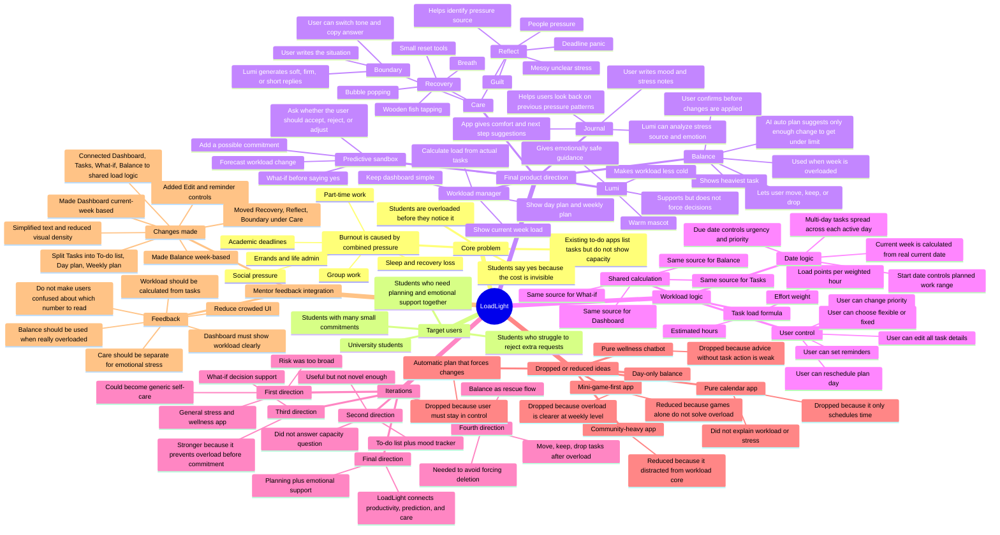
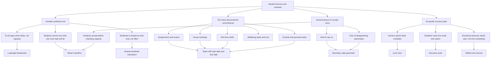
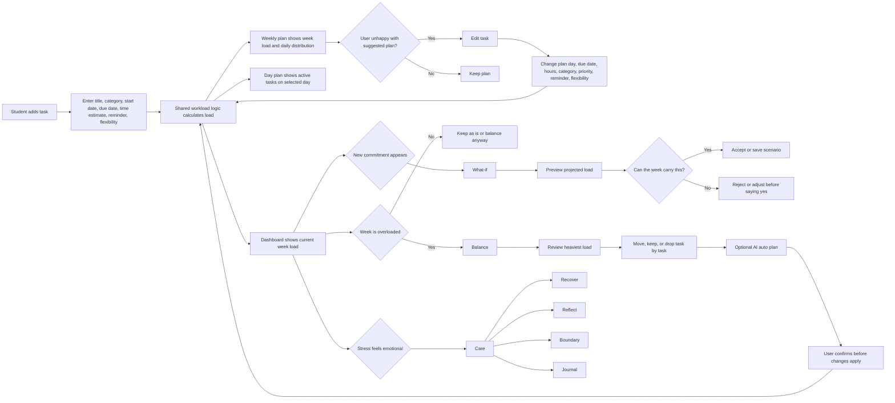

# LoadLight Ideation Mindmap And Tables

This document is editable source material for the README ideation section. It is written in Markdown so the team can copy, shorten, or edit it directly.

## 1. Detailed Mindmap

Paste this Mermaid block into a Markdown renderer that supports Mermaid, or use it as the editable text source for a Canva/Figma mindmap.

## 2. Problem Tree

## 3. User Flow Diagram

## 4. Ideas We Considered

| Idea | Kept / dropped / reduced | Why | What we learned | Evidence in final app |
|---|---|---|---|---|
| LoadLight: workload manager with Dashboard, Tasks, What-if, Balance, Care, Journal | Kept | It connects planning with emotional capacity. It answers "Can I still carry this?" instead of only "What should I do next?" | The strongest idea was not another to-do list, but a capacity-aware planning tool. | Dashboard load, task load calculation, What-if forecast, Balance flow, Care tools, Journal. |
| Task-based workload calculation | Kept | Mentor feedback said workload must be calculated from tasks, not a random mood number. | A credible workload score needs a visible input source. | Users enter task time, category, start date, due date, flexibility, reminder. Load updates from tasks. |
| Shared workload logic across pages | Kept | If Dashboard, Tasks, What-if, and Balance use different numbers, users cannot trust the app. | Data consistency is a product decision, not only a technical decision. | Shared load logic powers all workload displays. |
| What-if predictive sandbox | Kept | Students often accept extra work before seeing the cost. This feature makes the invisible cost visible. | Prevention is more novel than only recovery. | User tests an extra commitment before accepting. |
| Balance move / keep / drop flow | Kept | Overload needs concrete action, not just advice. | Balance should reduce overload without forcing users to delete everything. | User decides task by task; AI auto plan only suggests; confirm required. |
| AI auto plan | Kept with guardrails | It is helpful only if it reduces enough load, not if it blindly moves/drops everything. | Automation must stay user-controlled. | Auto plan opens confirmation modal and user can adjust before confirm. |
| Task rescheduling | Kept | Mentor/team feedback: if app schedules something badly, user needs control. | Suggested plans should be editable. | Edit task lets user change plan day, due date, time, category, reminder, priority, flexibility. |
| Reminder before tasks | Kept | A plan is more useful if the app can nudge the user before work starts. | Small reminder settings make the prototype feel complete. | User can set no reminder, 5 min, 10 min, or 30 min before. |
| Day plan | Kept | Students need to know what is active on one day. | Day view should use date ranges, not only start date. | Multi-day tasks appear on every active day between start and due date. |
| Weekly plan | Kept | Burnout is easier to understand at week level. | Balance should use weekly load, not only daily load. | Weekly plan shows selected week, day cards, daily load, and active tasks. |
| Journal with mood and stress analysis | Kept | Stress is not only scheduling. Users need a place to write what happened and receive comfort. | Journal turns emotional reflection into usable wellbeing insight. | User records mood/note; Lumi can analyze stress source and give comfort or next step. |
| Boundary reply generator | Kept | Many students overload because they cannot reject requests. | Saying no is a workload management feature. | User describes situation; app generates soft, firm, short replies. |
| Recovery tools | Kept | When stress is high, users need one immediate reset. | Recovery should be tiny and actionable. | Breath, wooden fish tapping, bubble popping. |
| Reflect tool | Kept | Users may not know whether they need a task move, rest, or boundary. | The app should help identify the real pressure source first. | Reflect asks one small question based on guilt, deadline panic, people pressure, or messy stress. |
| Community feature | Reduced | It can support students, but too much community made the app feel crowded and less focused. | The core value is workload clarity first. | Community remains secondary, not the main demo flow. |
| Mini-game-first stress app | Reduced | Games are fun but do not solve planning or overload by themselves. | Mini games should support recovery, not define the product. | Mini games are under Care/relief, not the main feature. |
| Pure to-do list | Dropped | Too generic and already exists. It does not answer whether the user has capacity. | A normal list is not enough for burnout prevention. | Tasks are used as input for load calculation, not as the whole app. |
| Pure calendar planner | Dropped | A calendar shows time blocks but not mental/social/physical load. | Time and workload are related but not the same. | Load points include effort weight and categories. |
| Pure wellness chatbot | Dropped | A chatbot can comfort the user, but without task action it may feel like generic advice. | Emotional support must connect to planning action. | Lumi appears across planning, Balance, Boundary, Reflect, and Journal. |
| Forced automatic scheduling | Dropped | Users disliked the feeling that the app was deciding for them. | The app should suggest, not control. | Confirm plan is required before changes happen. |
| Day-only overload repair | Dropped | Moving work within the same day/week often does not reduce weekly pressure. | Balance should move tasks out of the overloaded week when needed. | Move sends flexible tasks to next week. |

## 5. Iteration And Idea Evolution

| Stage | Version of idea | Problem with that version | Decision / pivot | Result in final solution |
|---|---|---|---|---|
| 1 | General stress app | Too broad. Could become another self-care app. | Narrowed to student workload and burnout prevention. | LoadLight focuses on task load and capacity. |
| 2 | Mood tracker and journal | Useful but not enough to solve overloaded schedules. | Kept journal, but made it support stress analysis instead of being the whole app. | Journal became part of Lumi care and emotional insight. |
| 3 | Simple to-do list | Too common. Did not show whether the user could accept more. | Turned tasks into workload inputs. | Task form collects time, category, dates, flexibility, reminder. |
| 4 | Dashboard with static load | Looked nice, but mentor feedback questioned how workload was calculated. | Connected workload to task data. | Dashboard now calculates current week load from tasks. |
| 5 | What-if as a saved scenario page | Good idea, but page felt crowded and hard to scan. | Restored simpler What-if homepage and reduced visual density. | What-if is now a focused decision sandbox. |
| 6 | Balance as a task deletion flow | Felt too harsh and confusing; not everything should be dropped. | Changed to move / keep / drop with user confirmation. | Balance helps make the week carryable, not empty. |
| 7 | AI plan applied too aggressively | It moved/dropped too many tasks even when only small reduction was needed. | Added logic to stop after enough load is reduced. | AI auto plan suggests only enough changes and asks for confirmation. |
| 8 | Day plan only showed start date | Multi-day tasks disappeared after the first day. | Changed active day logic to include start-to-due range. | A Sep 16-Sep 19 task appears on Sep 16, 17, 18, and 19. |
| 9 | Dashboard followed selected week | Confusing, because dashboard should mean current week. | Dashboard now follows real current week; Tasks and Balance can still select other weeks. | On Sep 12 it shows Sep 7-Sep 13; next week it will show Sep 14-Sep 20. |
| 10 | Reschedule only changed date/reminder | Teammate feedback: users may want to edit all task details. | Replaced with full Edit controls. | User can edit title, category, hours, dates, reminder, priority, flexibility. |

## 6. Mentor Consultation And Feedback Integration

| Date | Mentor / source | Feedback received | What was changed | Why it matters |
|---|---|---|---|---|
| 2026-09-11 | Yeong Chiau Wen | "How can workload be calculated?" The dashboard needs to make clear that load comes from tasks. | Connected Dashboard load to actual tasks through shared workload logic. | Judges can see the score has a reason, not just a decorative percentage. |
| 2026-09-11 | Yeong Chiau Wen | Dashboard should be one of the remaining core features. | Kept Dashboard as the first warning screen. | It gives users the fastest answer: how heavy is this week? |
| 2026-09-11 | Yeong Chiau Wen | Balance should be for when the user is really overloaded. | Balance became a week-based overload repair flow. | It prevents Balance from feeling like random task management. |
| 2026-09-11 | Yeong Chiau Wen | Care should be for when the user feels really stressed and needs help managing it. | Recovery, Reflect, and Boundary were grouped under Care. | Emotional support is separated from task balancing, so the app is easier to understand. |
| 2026-09-11 | Yeong Chiau Wen | Recovery should let users pick one reset. | Added small recovery tools such as breathing, wooden fish tapping, and bubble popping. | Recovery becomes an immediate action, not generic advice. |
| 2026-09-11 | Yeong Chiau Wen | Reflect should help users revise/reflect when pressure is unclear. | Reflect asks one small question based on the stress reason. | Users can understand whether they need rest, a boundary, or schedule changes. |
| 2026-09-11 | Yeong Chiau Wen | Boundary should help users who do not know how to reject someone. | Boundary lets users describe the situation and generate soft, firm, or short replies. | Saying no becomes part of workload protection. |
| 2026-09-11 | Yeong Chiau Wen | The app had too many pages and too many priorities. | Reduced feature emphasis and grouped care tools together. | The demo flow is clearer: Tasks -> Dashboard -> What-if -> Balance -> Care. |
| 2026-09-12 | Team feedback | If users dislike the app's suggested schedule, they should be able to reschedule. | Added Edit controls on To-do List, Day plan, and Weekly plan. | The app guides without taking control away from the student. |
| 2026-09-12 | Team feedback | Users should be able to set reminders before tasks. | Added reminder selection during Add task and Edit task. | The plan becomes actionable, not just informational. |
| 2026-09-12 | Team feedback | Workload numbers across pages must not conflict. | Shared calculation is used across Dashboard, Tasks, What-if, and Balance. | Consistent numbers build trust. |
| 2026-09-12 | Team feedback | Dashboard should mean current week, not whichever week the user last selected. | Dashboard current week is calculated from real current date. | On judging day, it automatically reflects that week. |

## 7. Breadth Of Exploration Summary

| Exploration direction | What we tested mentally / visually | Outcome |
|---|---|---|
| Productivity app | To-do list, day plan, weekly plan, reminders, rescheduling | Kept, but made it workload-aware. |
| Decision-support app | What-if scenario testing before accepting commitments | Kept as a core differentiator. |
| Wellness app | Breathing, reflection, boundary replies, journal | Kept as Care, not as the whole product. |
| Social app | Community posts, peer support, shared rooms | Reduced because it could distract from the main workload story. |
| Game-like relief | Wooden fish, bubble popping, breathing | Kept as small reset tools only. |
| AI planning | Auto plan, suggested moves, generated replies | Kept with confirmation and user control. |
| Calendar planner | Scheduling and rescheduling tasks | Partially kept through start date, due date, day plan, weekly plan, and reminders. |
